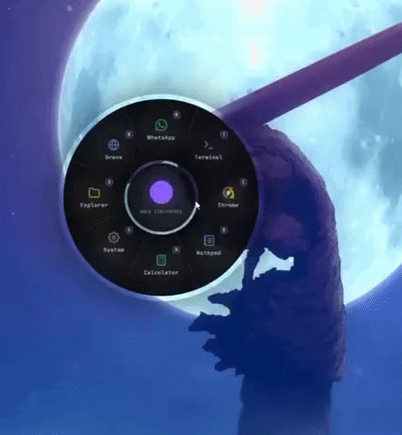
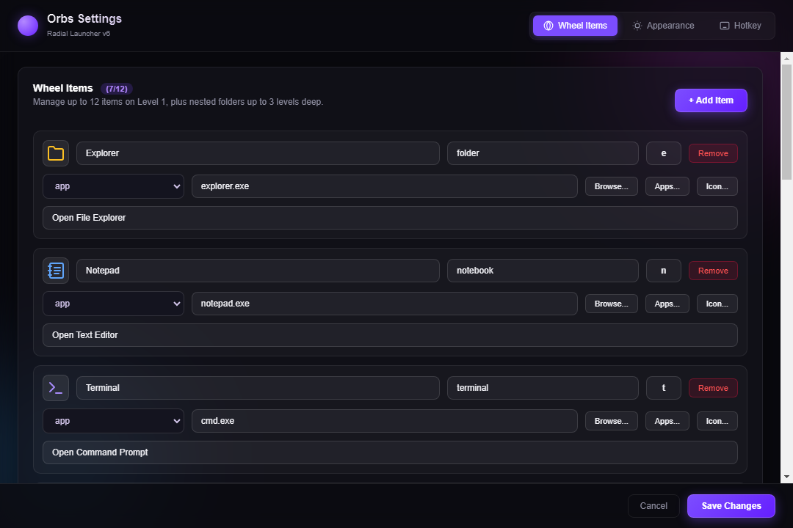

# Orbs

A radial application launcher for Windows.



## Features

- **Global Hotkey Trigger** — Summon the radial wheel instantly from anywhere via a customizable shortcut (default: `Ctrl + Space`).
- **Nested Folders** — Organize apps, scripts, and links into hierarchical submenus up to 3 levels deep.
- **Quick Keys** — Assign a single character (letter or number) to any item to fire it immediately without cursor navigation.
- **Built-in Calculator Widget** — Perform inline math calculations directly within the wheel interface.
- **Start Menu App Picker** — Search and pick installed Windows applications directly without manually finding executable paths.
- **Appearance Customization** — Adjust radial wheel diameter, backdrop blur intensity, and select visual themes.

---

## Installation

1. Download the latest `Orbs-v1.0.0-Windows-x64.zip` from the [Releases](https://github.com/agam1234555/orbs-launcher/releases) page.
2. Extract the archive into a folder of your choice.
3. Double-click `Orbs.exe` to launch.

> [!IMPORTANT]
> **Windows SmartScreen Note**:  
> This build is unsigned, so Windows SmartScreen will warn on first run. Click **More info → Run anyway**.

---

## Configuration

- **Accessing Settings**: Right-click or click the Orbs icon in the Windows System Tray (notification area) and select **Settings**.
- **Configurable Options**:
  - **Hotkey**: Choose modifier keys (`Ctrl`, `Alt`, `Shift`) and trigger keys.
  - **Menu Items**: Add, edit, remove, and reorder items, URLs, system commands, or nested folders.
  - **Quick Key Bindings**: Assign custom single-key accelerators to specific entries.
  - **Appearance**: Adjust orb size (diameter in pixels), background blur strength, and interface styling.



---

## Building from Source

### Prerequisites
- Windows 10 or Windows 11
- [Node.js](https://nodejs.org/) (v18 or higher) & npm

### Steps

```bash
# Clone the repository
git clone https://github.com/agam1234555/orbs-launcher.git
cd orbs-launcher

# Install dependencies
npm install

# Run in development mode
npm start

# Build installer and portable binary
npm run dist
```

---

## Requirements

- **Operating System**: Windows 10 / Windows 11 (64-bit)

---

## License

This project is licensed under the [MIT License](LICENSE).

---

## Third-Party Credits

Orbs bundles and utilizes the following open-source assets:

- **[Lucide Icons](https://lucide.dev)** — Licensed under the ISC / MIT License.
- **[JetBrains Mono](https://github.com/JetBrains/JetBrainsMono)** — Licensed under the SIL Open Font License 1.1.
