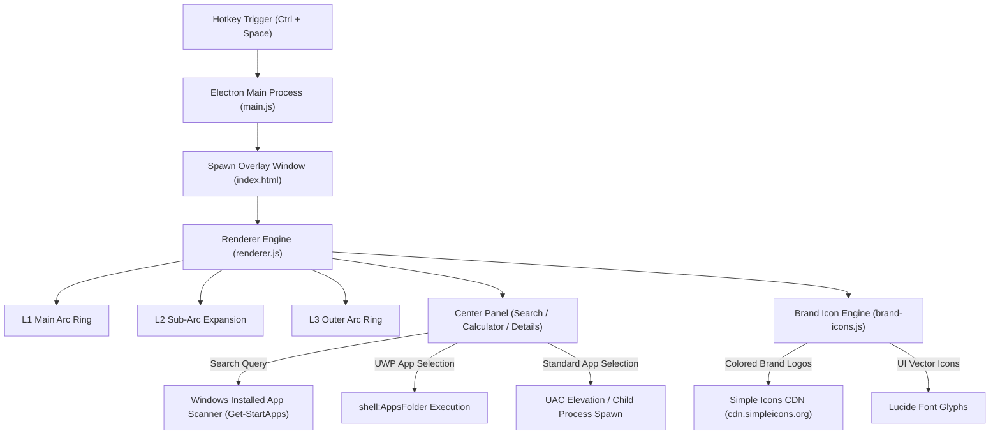

<div align="center">

# 🪐 Orbs Launcher

**A fast, modern, customizable radial application launcher and productivity wheel for Windows.**


</div>

---

## 🌟 About Orbs Launcher

**Orbs Launcher** brings a sleek, futuristic radial menu experience to Windows. Designed for high-speed productivity, Orbs lets you trigger applications, system commands, web links, and interactive widgets (like a real-time calculator and application search) with a single customizable hotkey (`Ctrl + Space`).

---

## ✨ Features

- 🎯 **Radial Concentric Rings**: Navigate multi-tiered sub-arcs (Level 1, Level 2, Level 3) with smooth mouse hover expansion.
- 🎨 **3,000+ Full-Color Brand Icons**: Powered by **Simple Icons** and **Lucide Icons** with automatic brand color detection and smart dark-mode contrast filters.
- 🔍 **Live Center App Search**: Search across 260+ Windows Desktop and **Microsoft Store (UWP)** apps (`Spotify`, `WhatsApp`, `VS Code`, etc.).
- 🔒 **Search & Widget Lock State**: Click the center orb or use widgets without holding down hotkeys.
- 🚀 **Silent Launch & UAC Support**: Runs silently in the background via `launch.vbs` and handles elevated Administrator apps (CPU-Z, Regedit, Task Manager) gracefully.
- ⌨️ **Single-Key Quick Shortcuts**: Map single keys to launch any item instantly on hotkey activation.
- 🌗 **Rich Custom Themes**: Cyberpunk, OLED Dark, Frost, Monokai, and Sunset color palettes.

---

## 📐 System Architecture & Flow



---

## 🚀 Getting Started

### Prerequisites

- **Node.js** (v18 or higher)
- **Windows 10 / 11**

### Installation

1. **Clone the repository:**
   ```bash
   git clone https://github.com/agam1234555/orbs-launcher.git
   cd orbs-launcher
   ```

2. **Install dependencies:**
   ```bash
   npm install
   ```

3. **Run Orbs Launcher:**

   - **Development Mode:**
     ```bash
     npm start
     ```
   - **Silent Background Mode (No CMD Window):**
     ```bash
     npm run start:silent
     ```
     *(Or double-click `launch.vbs` directly in File Explorer)*

---

## ⚙️ Configuration (`config.json`)

Orbs is fully configured via `config.json`. Below is an example structure:

```json
{
  "hotkey": {
    "key": "Space",
    "modifier": "Ctrl"
  },
  "appearance": {
    "theme": "cyberpunk",
    "orbSize": 470,
    "blurIntensity": 16
  },
  "items": [
    {
      "name": "Browsers",
      "icon": "globe",
      "type": "folder",
      "children": [
        { "name": "Google Chrome", "icon": "chrome", "type": "app", "target": "chrome.exe" },
        { "name": "Brave", "icon": "brave", "type": "app", "target": "brave.exe" }
      ]
    },
    {
      "name": "Spotify",
      "icon": "spotify",
      "type": "app",
      "target": "shell:AppsFolder\\SpotifyAB.SpotifyMusic_zpdnekdrzrea0!Spotify"
    },
    {
      "name": "Calculator",
      "icon": "calculator",
      "type": "widget",
      "target": "calculator"
    }
  ]
}
```

---

## 📦 Building Standalone Installer

To create a single `.exe` Windows installer:

```bash
npm run dist
```

The output installer will be saved in the `dist/` directory.

---

## 📄 License

This project is open-source and available under the [MIT License](LICENSE).
